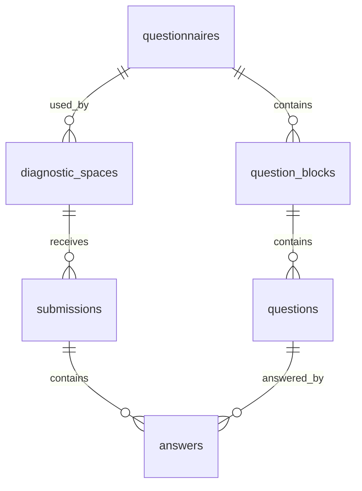

# Esquema de base de dades

Base de dades prevista: PostgreSQL a Supabase.

La taula principal d'espais s'anomena `diagnostic_spaces`. No ha d'existir cap taula `centres`.

Implementacio actual:

- Migracio: `supabase/migrations/20260604130000_initial_schema.sql`
- Indexos FK compostos: `supabase/migrations/20260604131500_add_composite_foreign_key_indexes.sql`
- RPC de submissions: `supabase/migrations/20260604143000_create_submission_rpc.sql`
- Conversió d'identificador de qüestionari: `supabase/migrations/20260604154605_convert_questionnaire_ids_to_three_digit_codes.sql`
- Conversió d'identificador de bloc: `supabase/migrations/20260604155650_convert_block_ids_to_two_digit_codes.sql`
- Seed: `supabase/seed.sql`
- Configuracio manual: `docs/SUPABASE_SETUP.md`

## Model relacional



## Taules

### `questionnaires`

Defineix versions de qüestionari.

Columnes proposades:

- `id text primary key`
- `version text not null unique`
- `title text not null`
- `is_active boolean not null default false`
- `created_at timestamptz not null default now()`

Restriccions:

- `id` amb format de 3 digits (`001`, `002`, ...).
- `version` unique.
- La versió inicial és `2026.1`; la versió activa corregida és `2026.2`.

### `question_blocks`

Defineix els blocs d'una versió.

Columnes proposades:

- `id text not null`
- `questionnaire_id text not null references questionnaires(id) on delete restrict`
- `position integer not null`
- `title text not null`

Restriccions:

- `id` amb format de 2 digits (`01`, `02`, ...), scoped per `questionnaire_id`.
- `primary key (id, questionnaire_id)`
- `unique (questionnaire_id, position)`
- `position between 1 and 5`

### `questions`

Defineix preguntes tancades.

Columnes proposades:

- `id uuid primary key default gen_random_uuid()`
- `questionnaire_id text not null references questionnaires(id) on delete restrict`
- `block_id text not null`
- `position integer not null`
- `block_position integer not null`
- `text text not null`
- `scale_min integer not null default 0`
- `scale_max integer not null default 2`

Restriccions:

- `unique (questionnaire_id, position)`
- `unique (questionnaire_id, block_id, block_position)`
- `foreign key (block_id, questionnaire_id) references question_blocks(id, questionnaire_id)`
- `position between 1 and 20`
- `block_position between 1 and 4`
- `scale_min = 0`
- `scale_max = 2`

La migració usa claus foranes compostes per garantir que bloc, pregunta, submission i resposta pertanyen a la mateixa versió del qüestionari.

El seed inclou una validació que garanteix 5 blocs, 20 preguntes i 4 preguntes per bloc per a la versió activa.

### `diagnostic_spaces`

Espais anònims de diagnosi.

Columnes proposades:

- `id uuid primary key default gen_random_uuid()`
- `public_code text not null unique`
- `private_token_hmac text not null`
- `questionnaire_id text not null references questionnaires(id) on delete restrict`
- `is_active boolean not null default true`
- `created_at timestamptz not null default now()`
- `closed_at timestamptz`

Restriccions:

- `public_code` unique.
- `public_code` amb check de format, per exemple `^C-[A-HJ-KM-NP-Z2-9]{4}-[A-HJ-KM-NP-Z2-9]{4}$`.
- Cap columna de nom de centre, codi de centre o persona responsable.

Indexos:

- `unique index diagnostic_spaces_public_code_key on diagnostic_spaces(public_code)`

### `submissions`

Enviaments anònims.

Columnes proposades:

- `id uuid primary key default gen_random_uuid()`
- `diagnostic_space_id uuid not null references diagnostic_spaces(id) on delete restrict`
- `questionnaire_id text not null references questionnaires(id) on delete restrict`
- `created_at timestamptz not null default now()`

Restriccions:

- No hi ha usuari, email, IP ni user agent.
- No es mostra mai al tauler ni al PDF.

Indexos:

- `index submissions_diagnostic_space_id_idx on submissions(diagnostic_space_id)`

### `answers`

Respostes tancades.

Columnes proposades:

- `id uuid primary key default gen_random_uuid()`
- `submission_id uuid not null references submissions(id) on delete cascade`
- `questionnaire_id text not null`
- `question_id uuid not null references questions(id) on delete restrict`
- `value integer not null`

Restriccions:

- `value in (0, 1, 2)`
- `unique (submission_id, question_id)`

La columna `questionnaire_id` és tècnica i permet reforçar amb claus foranes compostes que una resposta no apunti a una pregunta d'una altra versió.

Indexos:

- `index answers_question_id_idx on answers(question_id)`
- `index answers_submission_id_idx on answers(submission_id)`

## RLS

Activar RLS:

```sql
alter table questionnaires enable row level security;
alter table question_blocks enable row level security;
alter table questions enable row level security;
alter table diagnostic_spaces enable row level security;
alter table submissions enable row level security;
alter table answers enable row level security;
```

No crear polítiques públiques de lectura per a:

- `diagnostic_spaces`
- `submissions`
- `answers`

Opcions per a qüestionari públic:

1. Servir tambe `questionnaires`, `question_blocks` i `questions` només via servidor.
2. Crear polítiques públiques de lectura només per a qüestionaris publicats.

Opció recomanada per simplicitat i coherència de seguretat: servir totes les lectures via servidor en la primera versió.

## Transaccions

Supabase JS no ofereix una transacció SQL multisentència arbitrària des del client REST. Per inserir submissions i answers atòmicament, la implementació actual usa:

- Funció SQL RPC `public.create_submission_with_answers(text, text, jsonb)`.
- Execucio només des del servidor amb `service_role`.
- Revocacio d'`execute` per a `anon` i `authenticated`.
- Validacio de forma del payload, 20 respostes exactes, camps permesos, duplicats, valors `0`, `1`, `2` i pertinença de preguntes al qüestionari.
- Inserció de `submissions` i `answers` en una única transacció de PostgreSQL.

Alternativa:

- Usar connexió Postgres server-side amb `pg` i transaccions explícites. Això afegeix una dependència i una variable d'entorn addicional.

## Consulta de resultats de conjunt

Els resultats de conjunt poden calcular-se:

- En SQL amb consultes agrupades.
- En servidor TypeScript a partir de files internes, no de submissions exposades al client.

Cal retornar:

- `totalSubmissions`
- `globalAverage`
- `blockAverages`
- `questionAverages`
- `questionDistributions`

## Seed inicial

El fitxer `supabase/seed.sql` ha d'inserir:

- `questionnaires.version = '2026.2'`
- 5 blocs
- 20 preguntes

Les preguntes d'una versió amb respostes no s'han d'editar. Els canvis futurs creen una nova fila a `questionnaires` i noves files de blocs i preguntes.

## Migracio inicial orientativa

```sql
create extension if not exists pgcrypto;

create table questionnaires (
  id text primary key check (id ~ '^[0-9]{3}$'),
  version text not null unique,
  title text not null,
  is_active boolean not null default false,
  created_at timestamptz not null default now()
);

create table question_blocks (
  id text not null check (id ~ '^[0-9]{2}$'),
  questionnaire_id text not null references questionnaires(id) on delete restrict,
  position integer not null check (position between 1 and 5),
  title text not null,
  primary key (id, questionnaire_id),
  unique (questionnaire_id, position)
);

create table questions (
  id uuid primary key default gen_random_uuid(),
  questionnaire_id text not null references questionnaires(id) on delete restrict,
  block_id text not null,
  position integer not null check (position between 1 and 20),
  block_position integer not null check (block_position between 1 and 4),
  text text not null,
  scale_min integer not null default 0 check (scale_min = 0),
  scale_max integer not null default 2 check (scale_max = 2),
  unique (questionnaire_id, position),
  unique (questionnaire_id, block_id, block_position),
  foreign key (block_id, questionnaire_id) references question_blocks(id, questionnaire_id)
);

create table diagnostic_spaces (
  id uuid primary key default gen_random_uuid(),
  public_code text not null unique,
  private_token_hmac text not null,
  questionnaire_id text not null references questionnaires(id) on delete restrict,
  is_active boolean not null default true,
  created_at timestamptz not null default now(),
  closed_at timestamptz,
  check (public_code ~ '^C-[A-HJKMNP-Z2-9]{4}-[A-HJKMNP-Z2-9]{4}$')
);

create table submissions (
  id uuid primary key default gen_random_uuid(),
  diagnostic_space_id uuid not null references diagnostic_spaces(id) on delete restrict,
  questionnaire_id text not null references questionnaires(id) on delete restrict,
  created_at timestamptz not null default now()
);

create table answers (
  id uuid primary key default gen_random_uuid(),
  submission_id uuid not null references submissions(id) on delete cascade,
  questionnaire_id text not null,
  question_id uuid not null references questions(id) on delete restrict,
  value integer not null check (value in (0, 1, 2)),
  unique (submission_id, question_id)
);
```
