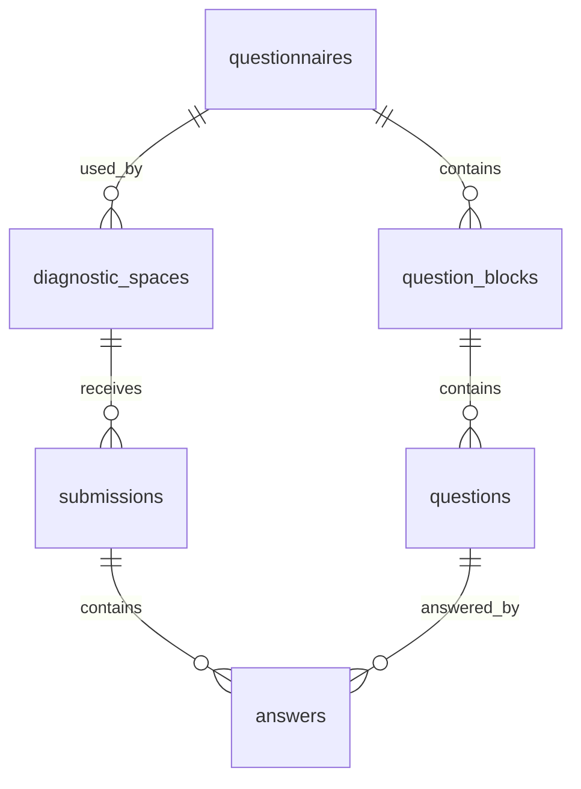

# Esquema de base de dades

Base de dades prevista a `main`: PostgreSQL a Supabase.

Base de dades prevista a `migration/mysql`: MySQL 8.4 local, amb esquema net
equivalent a l'estat funcional actual. Aquesta branca és experimental i no
substitueix `main` fins que el flux local complet estigui verificat.

La taula principal d'espais s'anomena `diagnostic_spaces`. No ha d'existir cap taula `centres`.

L'administracio global del qüestionari requereix una extensio controlada de
l'esquema. Aquesta extensio no pot afegir dades identificatives de centres o
participants i no pot donar accés directe a respostes individuals.

Implementacio actual:

- Migracio: `supabase/migrations/20260604130000_initial_schema.sql`
- Indexos FK compostos: `supabase/migrations/20260604131500_add_composite_foreign_key_indexes.sql`
- RPC de submissions: `supabase/migrations/20260604143000_create_submission_rpc.sql`
- Conversió d'identificador de qüestionari: `supabase/migrations/20260604154605_convert_questionnaire_ids_to_three_digit_codes.sql`
- Conversió d'identificador de bloc: `supabase/migrations/20260604155650_convert_block_ids_to_two_digit_codes.sql`
- RPC de resultats agregats: `supabase/migrations/20260605143459_create_aggregated_results_rpc.sql`
- Neteja de default obsolet de blocs: `supabase/migrations/20260609093301_drop_question_blocks_id_default.sql`
- Clau primaria composta de respostes: `supabase/migrations/20260609095253_use_composite_primary_key_for_answers.sql`
- Propietari OAuth i tokens de resultats: `supabase/migrations/20260609143524_add_auth_ownership_and_results_tokens.sql`
- Espai únic per creador i RPC de reinici: `supabase/migrations/20260609162000_add_single_owner_space_reset_rpc.sql`
- Límit de 300 submissions per espai: `supabase/migrations/20260610140500_limit_submissions_per_space.sql`
- Administradors globals: `supabase/migrations/20260611183000_add_admin_users.sql`
- RLS de lectura per administradors: `supabase/migrations/20260611184500_add_admin_read_rls_policies.sql`
- RPCs server-only d'administracio: `supabase/migrations/20260611190000_add_admin_service_rpcs.sql`
- Submissions per versio assignada a l'espai: `supabase/migrations/20260611193000_allow_submissions_for_space_questionnaire_version.sql`
- Seed: `supabase/seed.sql`
- Configuracio manual: `docs/SUPABASE_SETUP.md`

Implementacio prevista a `migration/mysql`:

- Client server-side: `lib/db/client.ts`.
- Esquema Drizzle: `lib/db/schema.ts`.
- Configuracio Drizzle: `drizzle.config.ts`.
- Repositoris server-side a `lib/repositories/*`.
- Seed local MySQL per a la versio activa `2026.2`.
- Sense acces directe del navegador a MySQL.

Les migracions PostgreSQL existents no s'han de traduir una a una. La branca
MySQL ha de definir un esquema net que preservi les taules, restriccions i
garanties de privacitat de l'estat final actual.

## Conversio PostgreSQL a MySQL

- `uuid` passa a `char(36)` o equivalent. Els UUIDs es generen des de
  TypeScript server-side.
- `timestamptz` passa a `datetime(3)` o equivalent, tractat com UTC.
- `jsonb` passa a `json`.
- Funcions `plpgsql` i RPCs passen a funcions TypeScript server-side.
- RLS passa a control d'acces server-side, validacio estricta i repositoris.
- Les operacions multi-taula passen a transaccions MySQL.
- Els casts PostgreSQL i expressions especifiques de PostgreSQL s'han de
  substituir per codi compatible amb MySQL.
- `DATABASE_URL` és una variable server-side i no pot tenir prefix
  `NEXT_PUBLIC_`.

## Model relacional



## Taules

### `questionnaires`

Defineix versions de qüestionari.

Columnes proposades:

- `id text primary key`
- `version text not null unique`
- `title text not null`
- `estimated_minutes integer not null default 10`
- `is_active boolean not null default false`
- `created_at timestamptz not null default now()`

Restriccions:

- `id` amb format de 3 digits (`001`, `002`, ...).
- `version` unique.
- `estimated_minutes` entre 1 i 120.
- La versió inicial és `2026.1`; la versió activa corregida és `2026.2`.

### `question_blocks`

Defineix els blocs d'una versió.

Columnes proposades:

- `id text not null`
- `questionnaire_id text not null references questionnaires(id) on delete restrict`
- `position integer not null`
- `title text not null`

Restriccions:

- `id` amb format de 2 digits (`01`, `02`, ...), scoped per `questionnaire_id`.
- `primary key (id, questionnaire_id)`
- `unique (questionnaire_id, position)`
- `position between 1 and 10`

### `questions`

Defineix preguntes tancades.

Columnes proposades:

- `id uuid primary key default gen_random_uuid()` a PostgreSQL.
  A MySQL: `char(36) primary key`, generat des de TypeScript.
- `questionnaire_id text not null references questionnaires(id) on delete restrict`
- `block_id text not null`
- `position integer not null`
- `block_position integer not null`
- `text text not null`
- `scale_min integer not null default 0`
- `scale_max integer not null default 3`

Restriccions:

- `unique (questionnaire_id, position)`
- `unique (questionnaire_id, block_id, block_position)`
- `foreign key (block_id, questionnaire_id) references question_blocks(id, questionnaire_id)`
- `position between 1 and 100`
- `block_position between 1 and 10`
- `scale_min = 0`
- `scale_max = 3`

La migració usa claus foranes compostes per garantir que bloc, pregunta, submission i resposta pertanyen a la mateixa versió del qüestionari.

El seed inicial inclou una validació que garanteix 5 blocs, 20 preguntes i
4 preguntes per bloc per a la versió activa inicial.

Regla d'edicio:

- Si una versio no està assignada a cap `diagnostic_space`, els administradors
  poden aplicar correccions menors sobre `questionnaires`, `question_blocks` i
  `questions`, incloent crear o eliminar blocs i preguntes mentre la versio
  encara és un esborrany.
- Si una versio ja està assignada a un `diagnostic_space`, l'edicio requereix
  confirmacio explícita des de l'administracio.
- Si una versio està activa o ja té respostes, només es poden corregir títols i
  textos existents; no es poden eliminar ni afegir blocs o preguntes in-place.
- Només una versio ha d'estar activa a la vegada.
- Activar una nova versio no actualitza `diagnostic_spaces.questionnaire_id`
  dels espais ja creats.
- El desat de contingut admet esborranys parcials amb com a màxim 10 blocs i
  10 preguntes per bloc. L'activacio exigeix almenys 1 bloc i almenys
  1 pregunta per bloc.

### `diagnostic_spaces`

Espais anònims de diagnosi.

Columnes proposades:

- `id uuid primary key default gen_random_uuid()` a PostgreSQL.
  A MySQL: `char(36) primary key`, generat des de TypeScript.
- `public_code text not null unique`
- `private_token_hmac text not null`
- `owner_user_id uuid references auth.users(id)` a PostgreSQL/Supabase.
  A MySQL: identificador opac d'usuari autenticat, sense FK a `auth.users`.
- `results_token_hash text not null`
- `results_token_encrypted text`
- `results_token_enabled boolean not null default true`
- `results_token_created_at timestamptz not null default now()`
- `results_token_expires_at timestamptz`
- `questionnaire_id text not null references questionnaires(id) on delete restrict`
- `is_active boolean not null default true`
- `created_at timestamptz not null default now()`
- `closed_at timestamptz`

Restriccions:

- `public_code` unique.
- `owner_user_id` únic quan no és null: cada creador autenticat pot tenir com a màxim un espai.
- `public_code` amb check de format, per exemple `^C-[A-HJ-KM-NP-Z2-9]{4}-[A-HJ-KM-NP-Z2-9]{4}$`.
- Cap columna de nom de centre, codi de centre o persona responsable.

Indexos:

- `unique index diagnostic_spaces_public_code_key on diagnostic_spaces(public_code)`
- `unique index diagnostic_spaces_owner_user_id_unique_idx on diagnostic_spaces(owner_user_id) where owner_user_id is not null`

### `submissions`

Enviaments anònims.

Columnes proposades:

- `id uuid primary key default gen_random_uuid()` a PostgreSQL.
  A MySQL: `char(36) primary key`, generat des de TypeScript.
- `diagnostic_space_id uuid not null references diagnostic_spaces(id) on delete restrict`
- `questionnaire_id text not null references questionnaires(id) on delete restrict`
- `created_at timestamptz not null default now()`

Restriccions:

- No hi ha usuari, email, IP ni user agent.
- No es mostra mai al tauler ni al PDF.

Indexos:

- `index submissions_diagnostic_space_id_idx on submissions(diagnostic_space_id)`

### `submission_locks`

Bloqueja una resposta per compte XTEC autenticat i codi public d'enquesta sense
guardar correus ni unir identitat amb respostes.

Columnes proposades:

- `diagnostic_space_id uuid not null references diagnostic_spaces(id) on delete cascade`
- `public_code text not null`
- `lock_hmac text not null`
- `created_at timestamptz not null default now()`

Restriccions:

- `primary key (diagnostic_space_id, lock_hmac)`
- `public_code` amb el mateix format que `diagnostic_spaces.public_code`
- `char_length(lock_hmac) >= 43`
- No hi ha `submission_id`, email, IP, user agent ni respostes.

Notes:

- `lock_hmac` es calcula al servidor amb secret server-side a partir de
  l'identificador opac autenticat i el codi public de l'enquesta.
- El reinici d'espai elimina els bloquejos associats.
- Les consultes de resultats no llegeixen aquesta taula.

### `answers`

Respostes tancades.

Columnes proposades:

- `submission_id uuid not null references submissions(id) on delete cascade`
- `questionnaire_id text not null`
- `question_id uuid not null references questions(id) on delete restrict`
- `value integer not null`

Restriccions:

- `value in (0, 1, 2, 3)`
- `primary key (submission_id, question_id)`

La columna `questionnaire_id` és tècnica i permet reforçar amb claus foranes compostes que una resposta no apunti a una pregunta d'una altra versió.

Indexos:

- `index answers_question_id_idx on answers(question_id)`
- `index answers_submission_id_idx on answers(submission_id)`

### `admin_users`

Autoritza l'administracio global server-side.

Columnes proposades:

- `user_id uuid primary key references auth.users(id) on delete cascade` a
  PostgreSQL/Supabase.
  A MySQL: identificador opac d'usuari autenticat, sense FK a `auth.users`.
- `role text not null default 'admin'`
- `is_active boolean not null default true`
- `created_at timestamptz not null default now()`
- `created_by uuid references auth.users(id) on delete set null` a
  PostgreSQL/Supabase.
  A MySQL: identificador opac opcional, sense FK a `auth.users`.

Restriccions:

- `role in ('admin')` inicialment.
- No desar noms, cognoms, emails ni cap dada de participants.
- La gestio d'administradors ha d'identificar usuaris pel seu `auth.users.id`.
  Si cal mostrar correus d'administradors, s'han d'obtenir server-side des de
  Supabase Auth i no copiar-los a la base de dades de l'aplicació.

### `app_settings`

Desa configuracio global no personal de l'aplicacio.

Columnes proposades:

- `setting_key varchar(64) primary key`
- `setting_value varchar(64) not null`
- `updated_at datetime(3) not null default current_timestamp(3)` a MySQL.

Restriccions:

- `setting_key` i `setting_value` no poden ser blancs.
- Per `setting_key = 'responsible_access_mode'`, `setting_value` només pot ser
  `all_xtec` o `centre_xtec`.
- Per `setting_key = 'admin_results_minimum_submissions'`, `setting_value` ha
  de ser un enter entre `0` i `10`.

Aquesta taula no pot desar noms de centre, codis de centre, correus ni cap
dada de participants. L'opcio `centre_xtec` només activa la comprovacio del
format del correu autenticat (`[a-e][0-9]{7}@xtec.cat`) en codi server-side.
L'opcio `admin_results_minimum_submissions` només desa un llindar agregat per
filtrar els resultats globals d'administracio.

RLS i permisos:

- RLS activat i forçat.
- `authenticated` només pot fer `select` si `current_user_is_admin()` és cert.
- `anon` no té grants.
- `service_role` pot consultar, inserir, actualitzar i eliminar files.
- Les altes, baixes i reactivacions d'administradors s'han de fer server-side.

Nota per a MySQL:

- MySQL no ofereix RLS equivalent a Supabase. La proteccio s'ha d'aplicar a la
  capa d'aplicacio: Route Handlers/server actions, repositoris server-side i
  validacio d'identitat abans de cada operacio sensible.
- `admin_users` no ha de copiar nom, cognoms ni email. Si el mode local
  provisional necessita mostrar un email per debug, aquest valor no s'ha de
  persistir a la taula.

## RLS

Aquest apartat aplica a `main` amb PostgreSQL/Supabase.

Activar RLS:

```sql
alter table questionnaires enable row level security;
alter table question_blocks enable row level security;
alter table questions enable row level security;
alter table diagnostic_spaces enable row level security;
alter table submissions enable row level security;
alter table answers enable row level security;
alter table admin_users enable row level security;
```

No crear polítiques públiques de lectura per a:

- `diagnostic_spaces`
- `submissions`
- `answers`

Per a l'administracio:

- `admin_users` ha de tenir RLS activat.
- Els administradors poden consultar directament només metadades necessaries de
  `questionnaires`, `question_blocks`, `questions` i `admin_users`.
- Aquesta lectura directa requereix rol `authenticated` i una fila activa a
  `admin_users`.
- Els rols de navegador no tenen grants directes d'`insert`, `update` ni
  `delete` sobre aquestes taules.
- El navegador no ha de tenir accés directe a `diagnostic_spaces`,
  `submissions` ni `answers`, encara que l'usuari sigui administrador.
- Les operacions que creen versions, activen versions o comproven submissions
  s'han de fer server-side amb validacio estricta i, quan afecten diverses
  taules, dins una RPC o transacció.

RPCs server-only:

- `public.bootstrap_first_admin(uuid)`: crea el primer administrador de manera
  atòmica quan `admin_users` és buida.
- `public.create_questionnaire_draft(text, text)`: crea una nova versio
  inactiva sense blocs ni preguntes.
- `public.copy_questionnaire_version(text, text, text)`: copia blocs i
  preguntes d'una versio existent a una nova versio inactiva.
- `public.replace_questionnaire_content(text, text, jsonb, boolean)`:
  reemplaça o corregeix títol, blocs i preguntes. La versio amb espais assignats
  requereix confirmacio. Si està activa o ja té respostes, només s'actualitzen
  títols i textos mantenint la mateixa estructura.
- `public.activate_questionnaire_version(text)`: activa una versio completa i
  desactiva la resta sense modificar espais existents.
- `public.delete_questionnaire_version(text)`: elimina una versio no activa i
  totes les dades dependents en ordre (`answers`, `submissions`,
  `diagnostic_spaces`, `questions`, `question_blocks`, `questionnaires`). És
  destructiva i només pot ser cridada pel servidor després d'una confirmacio
  explícita.

Totes aquestes RPCs revoquen execucio a `anon` i `authenticated` i només poden
ser cridades pel servidor amb `service_role`.

En `migration/mysql`, aquestes RPCs s'han de substituir per funcions
TypeScript server-side amb transaccions MySQL. Les funcions equivalents han de
mantenir la mateixa regla de no retornar files individuals.

Índexs d'administracio:

- `questionnaires_title_unique_idx` garanteix que no es puguin crear dues
  versions amb el mateix títol després de normalitzar espais i majúscules.

Opcions per a qüestionari públic:

1. Servir tambe `questionnaires`, `question_blocks` i `questions` només via servidor.
2. Crear polítiques públiques de lectura només per a qüestionaris publicats.

Opció recomanada per simplicitat i coherència de seguretat: servir totes les lectures via servidor en la primera versió.

## Transaccions

Supabase JS no ofereix una transacció SQL multisentència arbitrària des del client REST. Per inserir submissions i answers atòmicament, la implementació actual usa:

- Funció SQL RPC `public.create_submission_with_answers(text, text, jsonb)`.
- Execucio només des del servidor amb `service_role`.
- Revocacio d'`execute` per a `anon` i `authenticated`.
- Validacio de forma del payload, una resposta per cada pregunta de la versio,
  camps permesos, duplicats, valors `0`, `1`, `2`, `3` i pertinença de preguntes al
  qüestionari.
- Validacio que l'espai no supera 300 submissions completes.
- Validacio que la versio enviada coincideix amb la versio del qüestionari
  assignada a l'espai. Aquesta versio pot haver deixat de ser activa després de
  crear l'espai.
- Inserció de `submissions` i `answers` en una única transacció de PostgreSQL.

La RPC bloqueja la fila de `diagnostic_spaces` amb `FOR UPDATE` abans de comptar
submissions. Això evita que dos enviaments simultanis puguin superar el límit.

En `migration/mysql`, `createSubmissionWithAnswers()` ha de reproduir aquesta
garantia dins una transaccio MySQL, bloquejant l'espai abans de comptar
submissions i inserint `submissions` i `answers` de manera atomica. La validacio
ha de comprovar exactament totes les preguntes del qüestionari assignat a
l'espai, no un nombre fix hardcoded.

Per reiniciar un espai existent, la implementació usa:

- Funcio SQL RPC `public.reset_owner_diagnostic_space(uuid, text, text, text, text)`.
- Execucio només des del servidor amb `service_role`.
- Revocacio d'`execute` per a `anon` i `authenticated`.
- Eliminació de `answers` i `submissions` de l'espai.
- Reassignacio de `diagnostic_spaces.questionnaire_id` a la versio activa.
- Actualitzacio atòmica de `public_code`, `results_token_hash`,
  `results_token_encrypted` i metadades del token.
- Cap eliminació ni modificació de preguntes versionades.

Alternativa:

- Usar connexió Postgres server-side amb `pg` i transaccions explícites. Això afegeix una dependència i una variable d'entorn addicional.

## Consulta de resultats de conjunt

Els resultats de conjunt poden calcular-se:

- En SQL amb consultes agrupades mitjançant `public.get_diagnostic_answer_counts(uuid)`.
- En servidor TypeScript només a partir de totals agregats, no de files individuals de `answers`.

Implementacio actual:

- El servidor valida primer el token privat.
- Despres crida la RPC server-only `public.get_diagnostic_answer_counts(uuid)`.
- La RPC retorna només recomptes agregats per `question_id` i valor de l'escala (`0`, `1`, `2`, `3`).
- La RPC no retorna `submission_id`, timestamps, ni cap combinacio de respostes d'una mateixa persona.
- Els rols `anon` i `authenticated` no tenen permís d'execucio sobre aquesta funcio; només `service_role`.

En `migration/mysql`, el servidor ha d'obtenir aquests recomptes amb una
consulta `GROUP BY` a MySQL que retorni nomes `question_id`, `value` i
`answer_count`. El servidor no ha de carregar combinacions de respostes per
submission.

Cal retornar:

- `totalSubmissions`
- `globalAverage`, amb valor normalitzat a percentatge 0-100
- `blockAverages`, amb valors normalitzats a percentatge 0-100
- `questionAverages`, amb valors normalitzats a percentatge 0-100
- `questionDistributions`

## Seed inicial

El fitxer `supabase/seed.sql` ha d'inserir:

- `questionnaires.version = '2026.2'`
- 5 blocs
- 20 preguntes

El seed MySQL equivalent ha de crear la mateixa versio activa inicial. Aquesta
regla del seed no implica que el codi de submissions hagi de codificar sempre
20 preguntes: el nombre valid és el conjunt complet de preguntes del
qüestionari assignat a l'espai.

Les preguntes d'una versió assignada a un espai de diagnosi només s'han
d'editar després d'una confirmacio explícita. Si la versio ja té respostes, les
correccions in-place han de preservar els identificadors i l'estructura de les
preguntes existents.

## Migracio inicial orientativa

```sql
create extension if not exists pgcrypto;

create table questionnaires (
  id text primary key check (id ~ '^[0-9]{3}$'),
  version text not null unique,
  title text not null,
  is_active boolean not null default false,
  created_at timestamptz not null default now()
);

create table question_blocks (
  id text not null check (id ~ '^[0-9]{2}$'),
  questionnaire_id text not null references questionnaires(id) on delete restrict,
  position integer not null check (position between 1 and 10),
  title text not null,
  primary key (id, questionnaire_id),
  unique (questionnaire_id, position)
);

create table questions (
  id uuid primary key default gen_random_uuid(),
  questionnaire_id text not null references questionnaires(id) on delete restrict,
  block_id text not null,
  position integer not null check (position between 1 and 100),
  block_position integer not null check (block_position between 1 and 10),
  text text not null,
  scale_min integer not null default 0 check (scale_min = 0),
  scale_max integer not null default 3 check (scale_max = 3),
  unique (questionnaire_id, position),
  unique (questionnaire_id, block_id, block_position),
  foreign key (block_id, questionnaire_id) references question_blocks(id, questionnaire_id)
);

create table diagnostic_spaces (
  id uuid primary key default gen_random_uuid(),
  public_code text not null unique,
  private_token_hmac text not null,
  questionnaire_id text not null references questionnaires(id) on delete restrict,
  is_active boolean not null default true,
  created_at timestamptz not null default now(),
  closed_at timestamptz,
  check (public_code ~ '^C-[A-HJKMNP-Z2-9]{4}-[A-HJKMNP-Z2-9]{4}$')
);

create table submissions (
  id uuid primary key default gen_random_uuid(),
  diagnostic_space_id uuid not null references diagnostic_spaces(id) on delete restrict,
  questionnaire_id text not null references questionnaires(id) on delete restrict,
  created_at timestamptz not null default now()
);

create table answers (
  submission_id uuid not null references submissions(id) on delete cascade,
  questionnaire_id text not null,
  question_id uuid not null references questions(id) on delete restrict,
  value integer not null check (value in (0, 1, 2, 3)),
  primary key (submission_id, question_id)
);
```
