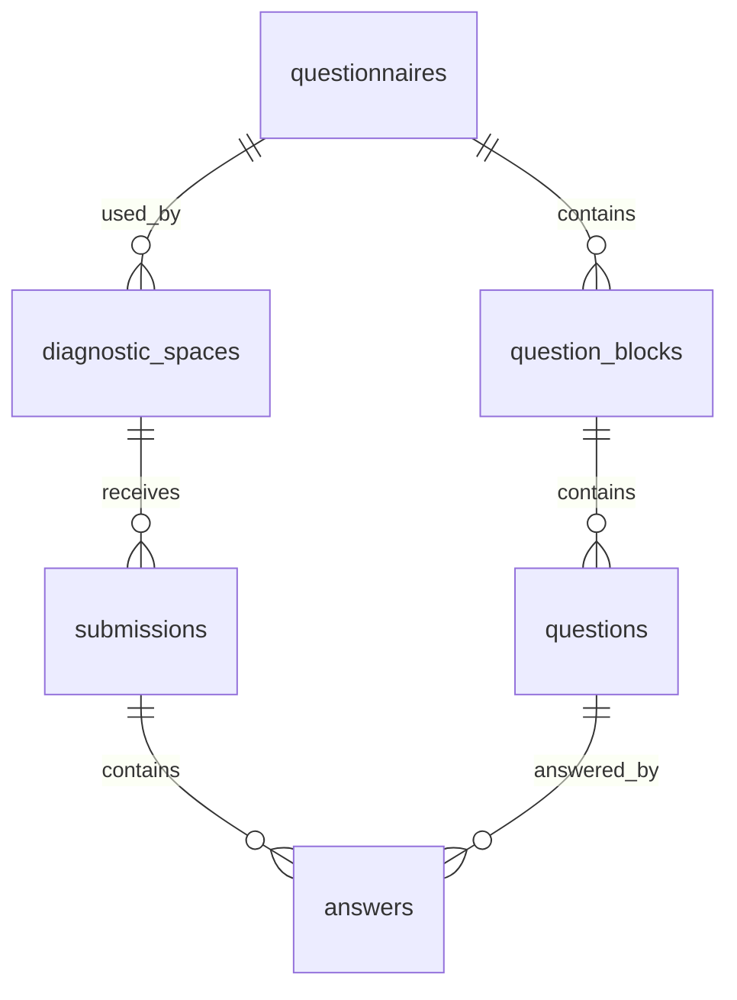

# Esquema de base de dades

Base de dades prevista: PostgreSQL a Supabase.

La taula principal d'espais s'anomena `diagnostic_spaces`. No ha d'existir cap taula `centres`.

## Model relacional



## Taules

### `questionnaires`

Defineix versions de questionari.

Columnes proposades:

- `id uuid primary key default gen_random_uuid()`
- `version text not null unique`
- `title text not null`
- `is_active boolean not null default false`
- `created_at timestamptz not null default now()`

Restriccions:

- `version` unique.
- La versio inicial es `2026.1`.

### `question_blocks`

Defineix els blocs d'una versio.

Columnes proposades:

- `id uuid primary key default gen_random_uuid()`
- `questionnaire_id uuid not null references questionnaires(id) on delete restrict`
- `position integer not null`
- `title text not null`

Restriccions:

- `unique (questionnaire_id, position)`
- `position between 1 and 5`

### `questions`

Defineix preguntes tancades.

Columnes proposades:

- `id uuid primary key default gen_random_uuid()`
- `questionnaire_id uuid not null references questionnaires(id) on delete restrict`
- `block_id uuid not null references question_blocks(id) on delete restrict`
- `position integer not null`
- `text text not null`
- `scale_min integer not null default 0`
- `scale_max integer not null default 2`

Restriccions:

- `unique (questionnaire_id, position)`
- `position between 1 and 20`
- `scale_min = 0`
- `scale_max = 2`

Nota: es recomana afegir una validacio, trigger o prova de seed que garanteixi 5 blocs, 20 preguntes i 4 preguntes per bloc per a `2026.1`.

### `diagnostic_spaces`

Espais anonims de diagnosi.

Columnes proposades:

- `id uuid primary key default gen_random_uuid()`
- `public_code text not null unique`
- `private_token_hmac text not null`
- `questionnaire_id uuid not null references questionnaires(id) on delete restrict`
- `is_active boolean not null default true`
- `created_at timestamptz not null default now()`
- `closed_at timestamptz`

Restriccions:

- `public_code` unique.
- `public_code` amb check de format, per exemple `^C-[A-HJ-KM-NP-Z2-9]{4}-[A-HJ-KM-NP-Z2-9]{4}$`.
- Cap columna de nom de centre, codi de centre o persona responsable.

Indexos:

- `unique index diagnostic_spaces_public_code_key on diagnostic_spaces(public_code)`

### `submissions`

Enviaments anonims.

Columnes proposades:

- `id uuid primary key default gen_random_uuid()`
- `diagnostic_space_id uuid not null references diagnostic_spaces(id) on delete restrict`
- `questionnaire_id uuid not null references questionnaires(id) on delete restrict`
- `created_at timestamptz not null default now()`

Restriccions:

- No hi ha usuari, email, IP ni user agent.
- No es mostra mai al tauler ni al PDF.

Indexos:

- `index submissions_diagnostic_space_id_idx on submissions(diagnostic_space_id)`

### `answers`

Respostes tancades.

Columnes proposades:

- `id uuid primary key default gen_random_uuid()`
- `submission_id uuid not null references submissions(id) on delete cascade`
- `question_id uuid not null references questions(id) on delete restrict`
- `value integer not null`

Restriccions:

- `value in (0, 1, 2)`
- `unique (submission_id, question_id)`

Indexos:

- `index answers_question_id_idx on answers(question_id)`
- `index answers_submission_id_idx on answers(submission_id)`

## RLS

Activar RLS:

```sql
alter table questionnaires enable row level security;
alter table question_blocks enable row level security;
alter table questions enable row level security;
alter table diagnostic_spaces enable row level security;
alter table submissions enable row level security;
alter table answers enable row level security;
```

No crear politiques publiques de lectura per a:

- `diagnostic_spaces`
- `submissions`
- `answers`

Opcions per a questionari public:

1. Servir tambe `questionnaires`, `question_blocks` i `questions` nomes via servidor.
2. Crear politiques publiques de lectura nomes per a questionaris publicats.

Opcio recomanada per simplicitat i coherencia de seguretat: servir totes les lectures via servidor en la primera versio.

## Transaccions

Supabase JS no ofereix una transaccio SQL multi-sentencia arbitraria des del client REST. Per inserir submissions i answers atomicament, es proposa:

- Crear una funcio SQL RPC `create_submission_with_answers`.
- Executar-la nomes des del servidor amb service role.
- La funcio valida existencia de l'espai i insereix submission i answers en una unica transaccio de PostgreSQL.

Alternativa:

- Usar connexio Postgres server-side amb `pg` i transaccions explicites. Aixo afegeix una dependencia i una variable d'entorn addicional.

## Consulta d'agregats

Els agregats poden calcular-se:

- En SQL amb consultes agrupades.
- En servidor TypeScript a partir de files agregades, no de submissions exposades al client.

Cal retornar:

- `totalSubmissions`
- `globalAverage`
- `blockAverages`
- `questionAverages`
- `questionDistributions`

## Seed inicial

El fitxer `supabase/seed.sql` ha d'inserir:

- `questionnaires.version = '2026.1'`
- 5 blocs
- 20 preguntes

Les preguntes d'una versio amb respostes no s'han d'editar. Els canvis futurs creen una nova fila a `questionnaires` i noves files de blocs i preguntes.

## Migracio inicial orientativa

```sql
create extension if not exists pgcrypto;

create table questionnaires (
  id uuid primary key default gen_random_uuid(),
  version text not null unique,
  title text not null,
  is_active boolean not null default false,
  created_at timestamptz not null default now()
);

create table question_blocks (
  id uuid primary key default gen_random_uuid(),
  questionnaire_id uuid not null references questionnaires(id) on delete restrict,
  position integer not null check (position between 1 and 5),
  title text not null,
  unique (questionnaire_id, position)
);

create table questions (
  id uuid primary key default gen_random_uuid(),
  questionnaire_id uuid not null references questionnaires(id) on delete restrict,
  block_id uuid not null references question_blocks(id) on delete restrict,
  position integer not null check (position between 1 and 20),
  text text not null,
  scale_min integer not null default 0 check (scale_min = 0),
  scale_max integer not null default 2 check (scale_max = 2),
  unique (questionnaire_id, position)
);

create table diagnostic_spaces (
  id uuid primary key default gen_random_uuid(),
  public_code text not null unique,
  private_token_hmac text not null,
  questionnaire_id uuid not null references questionnaires(id) on delete restrict,
  is_active boolean not null default true,
  created_at timestamptz not null default now(),
  closed_at timestamptz,
  check (public_code ~ '^C-[A-HJKMNP-Z2-9]{4}-[A-HJKMNP-Z2-9]{4}$')
);

create table submissions (
  id uuid primary key default gen_random_uuid(),
  diagnostic_space_id uuid not null references diagnostic_spaces(id) on delete restrict,
  questionnaire_id uuid not null references questionnaires(id) on delete restrict,
  created_at timestamptz not null default now()
);

create table answers (
  id uuid primary key default gen_random_uuid(),
  submission_id uuid not null references submissions(id) on delete cascade,
  question_id uuid not null references questions(id) on delete restrict,
  value integer not null check (value in (0, 1, 2)),
  unique (submission_id, question_id)
);
```
