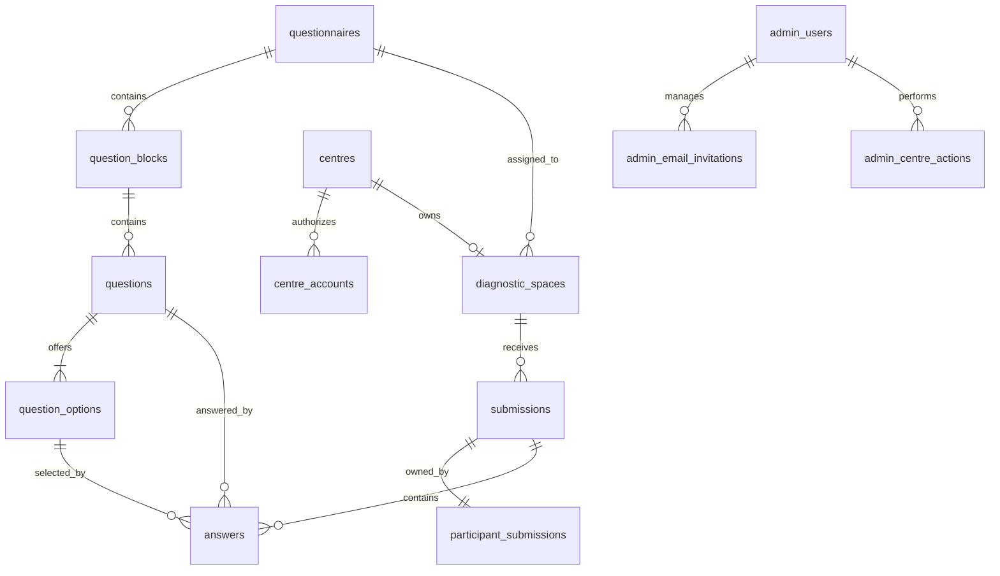

# Esquema de base de dades

La base de dades activa és MySQL 8.4. L'esquema executable és
`lib/db/schema.ts` i les migracions generades es desen a `drizzle/`.

La taula principal d'espais s'anomena `diagnostic_spaces`. Les identitats
institucionals es desen a `centres` i `centre_accounts`, separades de les
respostes.

## Principis

- El client MySQL és server-only.
- Els UUID es generen al servidor.
- Les dates es desen amb precisió de mil·lisegons i es tracten com UTC.
- Les relacions compostes garanteixen que espais, submissions, preguntes i
  respostes pertanyin a la mateixa versió.
- Les operacions multi-taula són transaccionals.
- Les consultes institucionals retornen només recomptes agregats; les consultes
  docents filtren per l'identificador pseudònim de la sessió.

## Relacions


```mermaid
erDiagram
  questionnaires ||--o{ question_blocks : contains
  question_blocks ||--o{ questions : contains
  questions ||--|{ question_options : offers
  questionnaires ||--o{ diagnostic_spaces : assigned_to
  centres ||--o{ centre_accounts : authorizes
  centres ||--o| diagnostic_spaces : owns
  diagnostic_spaces ||--o{ submissions : receives
  submissions ||--|| participant_submissions : owned_by
  submissions ||--o{ answers : contains
  questions ||--o{ answers : answered_by
  question_options ||--o{ answers : selected_by
  admin_users ||--o{ admin_email_invitations : manages
  admin_users ||--o{ admin_centre_actions : performs
```

## Taules

### `questionnaires`

Versions del qüestionari. L'identificador té tres dígits, la versió i el títol
són únics, els minuts estimats van d'1 a 120 i només una versió pot estar activa
des de la lògica transaccional d'administració. `language_code` és obligatori i
només admet `ca`, `es`, `eu`, `gl` o `oc`; fixa també la llengua dels informes.

### `question_blocks`

Blocs ordenats d'una versió. La clau primària és
`(id, questionnaire_id)`; l'identificador té dos dígits i la posició va d'1 a
10.

### `questions`

Preguntes tancades amb UUID, versió, bloc, posició global, posició dins del bloc
i text. `randomize_options` decideix si el formulari barreja les opcions i usa
colors neutres. L'escala vàlida és fixa de 0 a 3. Cada bloc admet entre 1 i 10
preguntes i cada versió fins a 100.

### `question_options`

Quatre opcions tancades per pregunta, amb UUID, versió, pregunta, text de fins
a 300 caràcters i puntuació fixa única `0`, `1`, `2` o `3`. Les opcions no es
tradueixen ni tenen fallback. La clau composta impedeix associar una resposta a
una opció d'una altra pregunta o versió.

### `centres`

Centres identificats amb correu institucional únic, codi oficial opcional, nom
oficial, municipi, àrea territorial, servei educatiu, estat de sincronització,
darrer intent i darrera actualització correcta. El correu és la clau estable
quan Dades Obertes encara no ha retornat cap fitxa.

També conté l'estat de l'alta (`profile_confirmed_at` i
`email_policy_configured_at`) i la política docent: `allow_xtec` i un únic
`custom_domain` opcional, que són excloents quan la política està configurada.
El domini es desa en minúscules i s'aplica per
coincidència exacta. Aquestes dades descriuen el centre, no identifiquen cap
docent.

`is_suspended`, `suspended_at` i `suspended_by` permeten bloquejar de manera
reversible el responsable i l'espai públic. No es relacionen amb cap resposta.

### `centre_accounts`

Comptes responsables amb identificador Google opac, correu i nom visible. Un
compte de centre s'associa al seu centre. En mode `all_xtec`, els comptes XTEC
no oficials tenen una fila de fitxa institucional per gestionar el seu espai
de prova; els administradors la tenen en qualsevol mode. La consulta a Dades
Obertes normalment queda amb estat `not_found` per a aquestes fitxes.

### `diagnostic_spaces`

Espais amb UUID, codi públic, propietari opac, centre opcional, versió
assignada, estat i metadades del token de resultats. El codi públic, el
propietari i el centre són únics. No conté correu de participant.

L'esquema manté `centre_id` nullable per compatibilitat, sense cap migració
nova. El codi exigeix una fitxa configurada per crear espais nous. El registre
del responsable vincula els seus espais antics sense centre a la seva fitxa,
sense modificar els codis públics, els tokens ni les respostes existents.

El token de resultats es conserva com HMAC i, quan s'ha de recuperar per al
creador, també xifrat amb una clau server-side.

### `submissions`

Enviaments pseudonimitzats amb UUID tècnic, espai, versió i data tècnica. No
contenen usuari, correu, IP o informació de dispositiu.

### `participant_submissions`

Vinculació separada entre una submission i l'identificador opac derivat del
`sub` de Google. `submission_id` és únic i la parella
`(diagnostic_space_id, participant_user_id)` també ho és. La clau forana
composta garanteix que la vinculació i la submission pertanyen al mateix espai.
No conté correu, nom, domini, IP ni informació del dispositiu i no participa en
cap consulta agregada de centre o administració.

### `answers`

Respostes tancades amb clau `(submission_id, question_id)`, versió i valor
entre 0 i 3. `option_id` identifica l'opció seleccionada i `value` conserva la
puntuació derivada al servidor. Les claus foranes compostes impedeixen barrejar
versions, preguntes i opcions.

### `admin_users`

Administradors identificats amb un identificador opac, correu XTEC, nom visible,
rol, estat, creador i darrera entrada. Aquesta és una excepció limitada a la
gestió administrativa i no pot relacionar-se amb respostes.

### `admin_email_invitations`

Invitacions d'administració pendents o acceptades. Desa el correu XTEC, qui
convida i la traça mínima d'acceptació. No pot contenir dades de participants.

### `admin_centre_actions`

Registre mínim de suspensions, reactivacions, reinicis i eliminacions de
centres. Desa un UUID, l'identificador i etiqueta institucional del centre, el
tipus d'acció, l'administrador, el recompte agregat afectat i la data. No té
clau forana cap a `centres` perquè el registre de governança es conserva després
d'una eliminació. No conté `submission_id`, `answer_id`, correus docents ni
contingut de respostes. `actor_user_id` utilitza `utf8mb4_unicode_ci`, la mateixa
col·lació que `admin_users.user_id`, per garantir que el `JOIN` administratiu
sigui compatible també en bases de dades amb `utf8mb4_0900_ai_ci` per defecte.

### `app_settings`

Configuració global no personal:

- `responsible_access_mode`: `all_xtec` o `centre_xtec`.
- `responsible_portal_status`: `closed` o `open`; controla globalment l'accés
  de centres i docents. Si no existeix, l'aplicació assumeix `closed` per
  fallar de manera segura.
- `admin_results_minimum_submissions`: enter de 0 a 10.
- `communication_subject`: assumpte global del comunicat.
- `communication_body`: text global amb les marques opcionals
  `{URL_QUESTIONARI}` i `{CODI_QUESTIONARI}`; el renderitzador garanteix que
  l'enllaç i el codi apareguin encara que la plantilla ometi les marques.
- `language_selector_visible`: booleà textual que mostra o oculta el selector
  d’idioma global.
- `visible_languages`: codis de llengua visibles separats per comes; sempre ha
  d’incloure `CA` mentre el contingut només estigui disponible en català.
- El comunicat també admet `{NOM_CENTRE}`.

No pot contenir dades de participants.

## Regles de versionat del qüestionari

- La versió inicial és `2026.1` i la versió activa corregida és `2026.2`.
- El seed actiu inicial conté 5 blocs i 20 preguntes amb escala 0-3.
- La migració crea per a cada pregunta existent les quatre opcions històriques,
  assigna `language_code = 'ca'` i deixa `randomize_options = false`.
- Una versió sense espais assignats pot editar estructura.
- Una versió assignada exigeix confirmació explícita abans d'editar-se.
- Una versió activa o amb respostes només permet corregir títols i textos
  mantenint identificadors, idioma, puntuacions, ordre aleatori i estructura.
- Els canvis estructurals creen una versió nova.
- Activar una versió no reassigna espais existents.

## Transaccions

La creació de submissions bloqueja la fila de l'espai, torna a consultar la
política de domini del centre i després comprova el límit i insereix submission,
vinculació de participant i respostes dins la mateixa transacció. La restricció
única de la vinculació impedeix duplicats. El correu docent no s'insereix en cap taula.

El reinici d'un espai elimina submissions, respostes i vinculacions, assigna la versió activa i
rota codi i token dins una transacció. No modifica el qüestionari versionat.

Les accions administratives sobre un centre bloquegen primer la seva fila. La
suspensió és reversible; els reinicis i l'eliminació esborren `answers`,
`submissions` (que elimina les vinculacions en cascada) en aquest ordre abans d'actualitzar o
eliminar l'espai. El registre administratiu s'insereix dins la mateixa
transacció.

La creació, còpia, activació i eliminació de versions també s'executa amb
transaccions server-side.

## Resultats agregats

Les consultes agrupen per `question_id` i `value` i retornen només el recompte.
No seleccionen `submission_id`, timestamps individuals ni combinacions de
respostes. El model final inclou totals, percentatges globals, per bloc i per
pregunta, i distribucions agregades.

Els resultats d'administracio poden limitar l'agregacio a un `centre_id`
identificat. La subconsulta d'espais elegibles aplica abans el llindar mínim de
respostes; un centre que no el supera no aporta recomptes al resultat. Aquesta
seleccio no modifica l'esquema ni crea cap relacio nova entre `centres` i les
respostes individuals.

Les consultes docents són repositoris separats: comencen a
`participant_submissions`, exigeixen `participant_user_id` de la sessió i no
retornen mai aquest valor ni els identificadors interns al navegador.

## Migracions i seed

```bash
npm run db:generate
npm run db:migrate
npm run db:seed
```

`db:push` es reserva per a desenvolupament local. Els entorns compartits han
d'aplicar migracions versionades de `drizzle/`.

La migració `0014_participant_results.sql` exigeix una còpia de seguretat prèvia
i buida transaccionalment `answers`, `submissions` i `submission_locks`, que
contenien només dades de prova. Després elimina `submission_locks` i crea la
vinculació nova. No modifica centres, responsables, espais, qüestionaris,
versions, administradors ni configuració. Després del desplegament cal verificar
que les dades de prova s'han eliminat i que la taula antiga ja no existeix.
